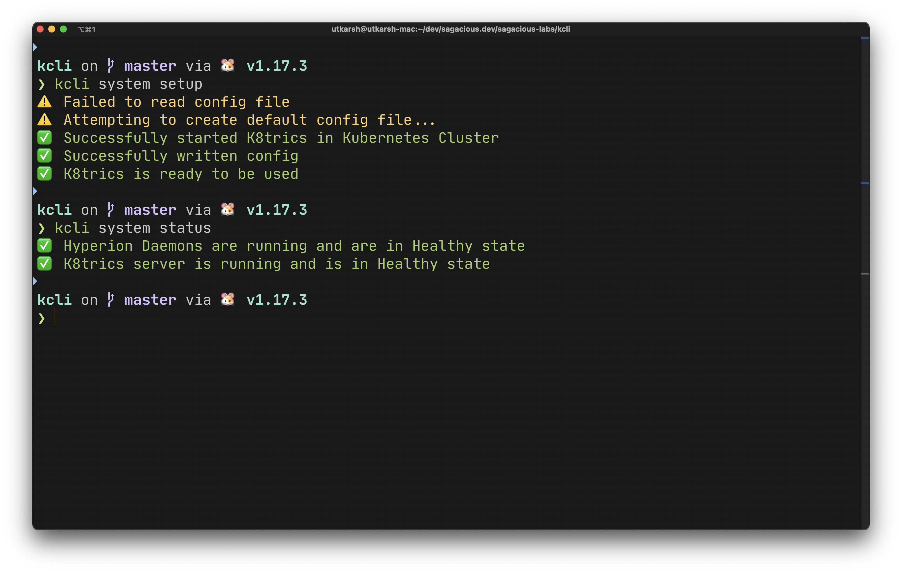
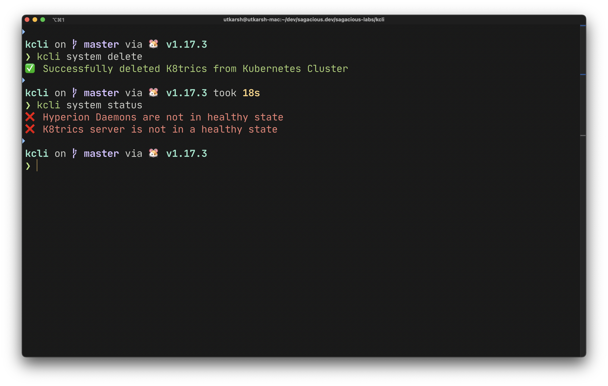
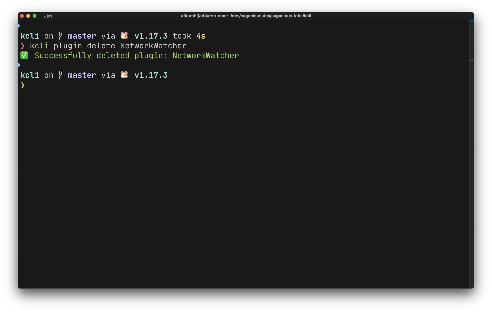
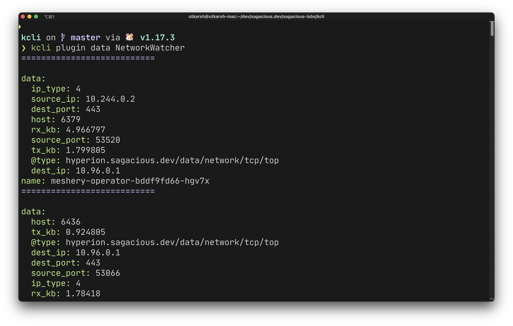
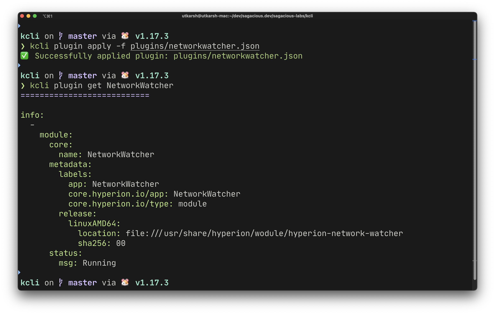

# K8trics CLI (kcli)

`kcli` is command line interface tool to interact with K8trics API server as well as manage its lifecycle. `kcli` can provision and deprovision K8trics from the Kubernetes Cluster.

## Screenshots

